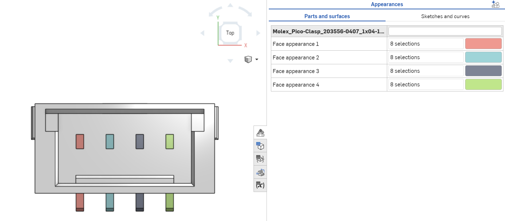

# RPi CM5 Interface Board Site

## 🌐 About the Site

This website is a digital pairing to the RPi CM5 Interface Board developed by Neurobionics, providing an interactive reference for its I/O pins and features. On the site you can find part numbers for connectors used on the board, mechanical diagrams, and datasheets from previous versions of the board. A PDF version of the datasheet is also available for download directly from the site.

> [!NOTE]
> When updating the site, always preserve previous PDF datasheets to maintain a historical archive of board iterations.

---

## 🚀 How to Update the Website

### Interactive PCB

1. **Generate renders:** Export the 3D model from KiCad's renderer with Orthographic View enabled. Export both front and back views of the board and label them: `pcb-front.png` and `pcb-back.png`.
2. **Upload assets:** Place the new `pcb-front.png` and `pcb-back.png` into `src/assets/`, replacing the old files. Keep the filenames exactly the same.
3. **Adjust markers:** Open `src/InteractivePCB.js`. Each component entry has two position fields:
   - `position`: the `top` and `left` percentages for the dot marker
   - `boxArea`: the `top`, `left`, `width`, and `height` percentages for the highlight box

   Both are relative to the PCB image dimensions. Tweak these values until the markers realign with the new images.

4. **New components:** Add a new entry to the `frontComponents` or `backComponents` object in `src/InteractivePCB.js`, copying the format of an existing marker. If the new component has a pinout image, also add an `import` line for it at the top of `src/InteractivePCB.js`.

#### I/O Pin Diagrams

The I/O pin diagrams are modeled in Onshape and labeled in a graphic design platform (e.g. Figma).

**Modeling in Onshape:**
1. Export your connector or header as a `.step` file and import it into Onshape.
2. In Part Studio, orient the part to Top View, then open the Appearances Panel and assign a color to each pin surface, switching colors per pin.

   **Pin Color Palette:**

    `#7E8496` &nbsp;  `#8594E8` &nbsp;  `#9AD5D9` &nbsp;  `#C2B7E3` &nbsp;  `#E7F15A` &nbsp;  `#FFD166` &nbsp;  `#F4978E` &nbsp;  `#BCE784`

   

3. Once all pins are colored, export the image as a `.png`.

4. Import the `.png` into your design tool and add labels using the label color palette below.

   **Label Color Palette:**

    `#646876` &nbsp;  `#6A76B6` &nbsp;  `#7FA8AC` &nbsp;  `#A099B9` &nbsp;  `#ABB151` &nbsp;  `#C9A85B` &nbsp;  `#C38079` &nbsp;  `#9BB972`

5. Export the final diagram as a `.png` and place it in `src/assets/`, replacing the existing file. Keep the filename the same. If the filename changes, update the matching `import` at the top of `src/InteractivePCB.js`.

---

### Mechanical Specifications

1. Export the full KiCad assembly as a `.step` file and import it into Onshape.
2. Create a drawing with Top, Bottom, and Front views. ([3-minute tutorial](https://www.youtube.com/watch?v=b_E4fBLOqFw))
3. Add dimensions for:
   - Length and width
   - Hole sizes
   - IMU dimensions relative to the board

   All labeling can be done directly in Onshape.
4. Export the drawing as `mechanical_specs.png` and replace the existing file in `src/assets/`.

---

### PDF Datasheet

All datasheets are edited in Overleaf using LaTeX.

1. The `latex` folder in this repo contains `main.tex` and all assets for the most recent datasheet version.
2. Download the folder and import all files into a single Overleaf project.
3. Update the technical specs, I/O pins, and mechanical details as needed.
4. Export the finished PDF and add it to `src/assets/`. **Do not delete previous `.pdf` files.**
5. In `src/App.js`, update the `datasheetPDF` import at the top of the file to point to your new PDF filename.
6. Add a new row at the top of the `Archive` table in the `Archive()` function in `src/App.js`. Include the version number, release date, and a list of new features and changes/fixes.

---

### Deploying Changes

After making any edits to source files:

1. Commit and push to the `main` branch.
2. GitHub Actions will automatically build the site and deploy it to GitHub Pages.
